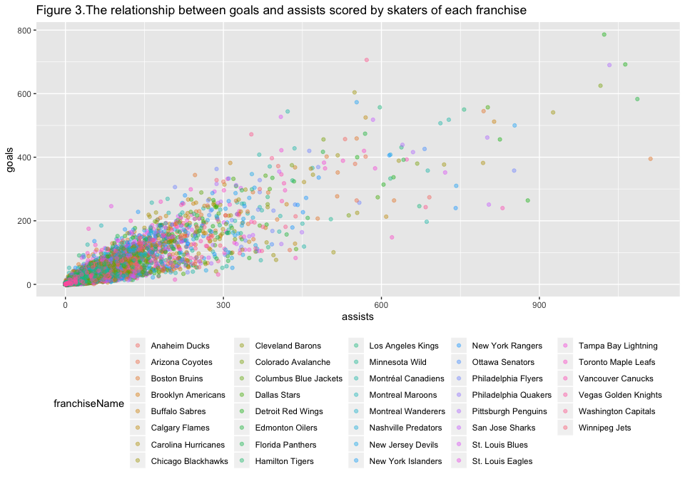

Project 1
================
Yilin Xie
June 12, 2020

  - [Data type (JSON) description](#data-type-json-description)
      - [What it is](#what-it-is)
      - [Where it gets used](#where-it-gets-used)
      - [Why it is a good way to store
        data](#why-it-is-a-good-way-to-store-data)
  - [Discussion of relevant R
    packages](#discussion-of-relevant-r-packages)
      - [rjson](#rjson)
      - [RJSONIO](#rjsonio)
      - [jsonlite](#jsonlite)
      - [The one I’ve chosen it](#the-one-ive-chosen-it)
  - [Functions to query the API](#functions-to-query-the-api)
      - [franchise](#franchise)
      - [franchise team](#franchise-team)
      - [franchise season records](#franchise-season-records)
      - [franchise goalie records](#franchise-goalie-records)
      - [franchise skater records](#franchise-skater-records)
  - [Data analysis](#data-analysis)
      - [Creation of relevant new
        variable](#creation-of-relevant-new-variable)
      - [Calculation of relevant numeric & graphical
        summaries](#calculation-of-relevant-numeric-graphical-summaries)
          - [Some contingency tables and numeric
            summaries](#some-contingency-tables-and-numeric-summaries)
          - [A side-by-side bar plot with
            coloring](#a-side-by-side-bar-plot-with-coloring)
          - [A side-by-side box plots with
            coloring](#a-side-by-side-box-plots-with-coloring)
          - [A scatter plots with
            coloring](#a-scatter-plots-with-coloring)

## Data type (JSON) description

### What it is

JSON, short for JavaScript Object Notation, is a data exchange format.
It is a data format popularized by Douglas Crockford in 2001
(<https://www.json.org/json-en.html>), which became the mainstream data
format since 2005-2006. JSON comes in a text format that is completely
independent of any programming language, making it an ideal data
exchange language. JSON is the syntax for storing and exchanging textual
information, similar to XML.

### Where it gets used

There is no other place where JSON is broadly used more than the Web.
Now the data interface basically returns JSON, and the detailed
scenarios include:

  - Ajxa accesses data asynchronously
  - RPC remote call
  - The front and back end separate the data returned by the back end
  - Open API, such as Baidu, Aude and other open interfaces
  - Interface for cooperation between enterprises
  - Simplify object creation in JS

### Why it is a good way to store data

JSON was born because the details of XML integration into HTML vary from
browser to browser. One drawback of XML formats, however, is the
complexity of document construction and the need to transfer more bytes.
In this case, JSON’s portability gained traction, replacing XML as the
dominant data transfer format. JSON is smaller, faster, and easier to
parse than XML. The biggest difference between XML and JSON is that it
is full of redundant information. Most of the time we don’t need
redundant information, but we just can’t do without it when we need it.
This is the biggest difference between XML and JSON. Json exists as a
typical 20% feature that addresses 80% of the requirements. In other
words, the fly swatter is found to be more handy where a cannon would
have to be used against mosquitoes. The concise and clear hierarchy
makes JSON an ideal data exchange language. Easy to read and write, and
also easy to machine parsing and generation, and effectively improve the
network transmission efficiency.

## Discussion of relevant R packages

Primaryly, there are three packages used for reading JSON data into R,
which are `rjson`, `RJSONIO`, and `jsonlite`.

### rjson

`rjson` was first implemented for R in 2007 by Alex Couture-Beil. It
allows R users to convert JSON objects into R object and vice-verse.
There are three functions available under `rjson` package: *fromJSON*,
*toJSON* and *newJSONParser*.

### RJSONIO

`RJSONIO` was created in 2010 by Duncan Temple Lang on GitHub. It allows
the R objects are inserted into the JavaScript/ECMAScript/ActionScript
code, and allow R programmers reading the JSON content and transform it
into R objects. `RJSONIO` is extensible, but it does not use the S4/S3
method. It allows others to define S4 methods for different R
classes/types, as well as for callers to specify different callback
handlers. Unlike the rjson package, the `RJSONIO` package USES a c++
library-libjson, instead of implementing another JSON parser, which
parses faster than pure interpreted R code. There are three main
functions in this package :*fromJSON*, *toJSON*, and *asJSVars*.

### jsonlite

`jsonlite` started from 2013 but has been completely rewritten in recent
versions. Like `RJSONIO`, it also provides functions, such as
*fromJSON()* and *toJSON() *to convert between JSON data and R objects.
It could also interact with web APIs, building pipelines and streaming
data between R and JSON.

### The one I’ve chosen it

I would choose `jsonlite` in to practice for several reasons:

  - `jsonlite` provides base64\_dec and base64\_enc to convert between
    raw vectors to text while the other two packages don’t have this
    function.  
  - Validating strings in JSON format is provided by `RJSONIO`
    (isJSONValid function) and `jsonlite` (validate) while `rjson`
    doesn’t have.  
  - `jsonlite` also provides the capability of re-formatting JSON file
    into: 1). structure with indentation added from prettify, 2). file
    by removing all unnecessary indentation and white spaces which is
    actually adopted by a lot of JavaScript libraries.

For further information, [this
page](https://rstudio-pubs-static.s3.amazonaws.com/31702_9c22e3d1a0c44968a4a1f9656f1800ab.html)
gives readers a brief comparison between three packages.

## Functions to query the API

``` r
## If you need, please download:
## xfun::session_info('DT')
library(DT)
library(tidyverse)
library(httr)
library(jsonlite)
```

### franchise

``` r
franchise_url <- "https://records.nhl.com/site/api/franchise" 
franchise <- GET(franchise_url) %>% content("text") %>% fromJSON(flatten=TRUE)
```

``` r
head(franchise$data, 
             caption = "Table 1.Franchise") ## assign the name of table by 'caption = ""'
```

    ##   id firstSeasonId lastSeasonId mostRecentTeamId teamCommonName teamPlaceName
    ## 1  1      19171918           NA                8      Canadiens      Montréal
    ## 2  2      19171918     19171918               41      Wanderers      Montreal
    ## 3  3      19171918     19341935               45         Eagles     St. Louis
    ## 4  4      19191920     19241925               37         Tigers      Hamilton
    ## 5  5      19171918           NA               10    Maple Leafs       Toronto
    ## 6  6      19241925           NA                6         Bruins        Boston

### franchise team

``` r
team_url <- "https://records.nhl.com/site/api/franchise-team-totals"
team <- GET(team_url) %>% content("text") %>% fromJSON(flatten=TRUE)
```

``` r
head(team$data, 
             caption = "Table 2.Total stats for every franchise")
```

    ##   id activeFranchise firstSeasonId franchiseId gameTypeId gamesPlayed
    ## 1  1               1      19821983          23          2        2937
    ## 2  2               1      19821983          23          3         257
    ## 3  3               1      19721973          22          2        3732
    ## 4  4               1      19721973          22          3         272
    ## 5  5               1      19261927          10          2        6504
    ## 6  6               1      19261927          10          3         515
    ##   goalsAgainst goalsFor homeLosses homeOvertimeLosses homeTies homeWins
    ## 1         8708     8647        507                 82       96      783
    ## 2          634      697         53                  0       NA       74
    ## 3        11779    11889        674                 81      170      942
    ## 4          806      869         46                  1       NA       84
    ## 5        19863    19864       1132                 73      448     1600
    ## 6         1436     1400        103                  0        1      137
    ##   lastSeasonId losses overtimeLosses penaltyMinutes pointPctg points roadLosses
    ## 1           NA   1181            162          44397    0.5330   3131        674
    ## 2           NA    120              0           4266    0.0039      2         67
    ## 3           NA   1570            159          57422    0.5115   3818        896
    ## 4           NA    124              0           5356    0.0147      8         78
    ## 5           NA   2693            147          85564    0.5125   6667       1561
    ## 6           NA    263              0           8132    0.0000      0        160
    ##   roadOvertimeLosses roadTies roadWins shootoutLosses shootoutWins shutouts
    ## 1                 80      123      592             79           78      193
    ## 2                  0       NA       63              0            0       25
    ## 3                 78      177      714             67           82      167
    ## 4                  0       NA       64              0            0        9
    ## 5                 74      360     1256             66           78      403
    ## 6                  0        7      107              0            0       44
    ##   teamId           teamName ties triCode wins
    ## 1      1  New Jersey Devils  219     NJD 1375
    ## 2      1  New Jersey Devils   NA     NJD  137
    ## 3      2 New York Islanders  347     NYI 1656
    ## 4      2 New York Islanders   NA     NYI  148
    ## 5      3   New York Rangers  808     NYR 2856
    ## 6      3   New York Rangers    8     NYR  244

### franchise season records

You can assign a certain value to specify the franchise in column
**franchiseId** and **franchiseName**. This is applicable to the
following three tables.

``` r
## combine all JSON files so that make it possible to apply interactive filtering
season<-data.frame()
for (i in 1:40){
  season_url <- paste("https://records.nhl.com/site/api/franchise-season-records?cayenneExp=franchiseId",i,collapse="",sep = "=")
  season0 <- GET(season_url) %>% content("text") %>% fromJSON(flatten=TRUE)
  season <- rbind(season, season0$data)
}
## put the two columns first for the user to find easily
season1 <- subset(season, select=-c(franchiseId, franchiseName))
col <- colnames(season1)
new_col <- c(col[1], "franchiseId","franchiseName", col[2:length(col)]) ## specify the order of columns
season2 <- season[new_col] ## arrange the columns in the specified order
```

``` r
## interactive table for users to specify the franchise
head(season2, 
          filter = 'top', 
          rownames = FALSE,
          caption = 'Table 3.Season records for a specific franchise')
```

    ##   id franchiseId       franchiseName fewestGoals fewestGoalsAgainst
    ## 1  8           1  Montréal Canadiens         155                131
    ## 2 41           2  Montreal Wanderers          NA                 NA
    ## 3 36           3    St. Louis Eagles          NA                 NA
    ## 4 37           4     Hamilton Tigers          NA                 NA
    ## 5 10           5 Toronto Maple Leafs         147                131
    ## 6  6           6       Boston Bruins         147                172
    ##   fewestGoalsAgainstSeasons fewestGoalsSeasons fewestLosses fewestLossesSeasons
    ## 1              1955-56 (70)       1952-53 (70)            8        1976-77 (80)
    ## 2                      <NA>               <NA>           NA                <NA>
    ## 3                      <NA>               <NA>           NA                <NA>
    ## 4                      <NA>               <NA>           NA                <NA>
    ## 5              1953-54 (70)       1954-55 (70)           16        1950-51 (70)
    ## 6              1952-53 (70)       1955-56 (70)           13        1971-72 (78)
    ##   fewestPoints fewestPointsSeasons fewestTies fewestTiesSeasons fewestWins
    ## 1           65        1950-51 (70)          5      1983-84 (80)         25
    ## 2           NA                <NA>         NA              <NA>         NA
    ## 3           NA                <NA>         NA              <NA>         NA
    ## 4           NA                <NA>         NA              <NA>         NA
    ## 5           48        1984-85 (80)          4      1989-90 (80)         20
    ## 6           38        1961-62 (70)          5      1972-73 (78)         14
    ##            fewestWinsSeasons homeLossStreak
    ## 1               1950-51 (70)              7
    ## 2                       <NA>              2
    ## 3                       <NA>              5
    ## 4                       <NA>              5
    ## 5 1981-82 (80), 1984-85 (80)              7
    ## 6               1962-63 (70)             11
    ##                                    homeLossStreakDates homePointStreak
    ## 1 Dec 16 1939 - Jan 18 1940, Oct 28 2000 - Nov 25 2000              34
    ## 2                            Dec 22 1917 - Dec 26 1917              NA
    ## 3                            Jan 08 1931 - Feb 03 1931              12
    ## 4                            Jan 03 1921 - Jan 29 1921               5
    ## 5                            Nov 11 1984 - Dec 05 1984              18
    ## 6                            Dec 08 1924 - Feb 17 1925              27
    ##                                   homePointStreakDates homeWinStreak
    ## 1                            Nov 01 1976 - Apr 02 1977            13
    ## 2                                                 <NA>            NA
    ## 3                            Dec 20 1922 - Feb 28 1923            10
    ## 4                            Nov 29 1924 - Jan 01 1925             5
    ## 5 Nov 28 1933 - Mar 10 1934, Oct 31 1953 - Jan 23 1954            13
    ## 6                            Nov 22 1970 - Mar 20 1971            20
    ##                                     homeWinStreakDates homeWinlessStreak
    ## 1 Nov 02 1943 - Jan 08 1944, Jan 30 1977 - Mar 26 1977                15
    ## 2                                                 <NA>                 2
    ## 3 Dec 30 1922 - Feb 28 1923, Nov 28 1925 - Jan 28 1926                 9
    ## 4                            Nov 29 1924 - Jan 01 1925                 5
    ## 5                            Jan 31 2018 - Mar 24 2018                11
    ## 6                            Dec 03 1929 - Mar 18 1930                11
    ##                                 homeWinlessStreakDates lossStreak
    ## 1                            Dec 16 1939 - Mar 07 1940         12
    ## 2                            Dec 22 1917 - Dec 26 1917          5
    ## 3                            Dec 11 1930 - Feb 03 1931          9
    ## 4                            Jan 03 1921 - Jan 29 1921          7
    ## 5 Dec 19 1987 - Jan 25 1988, Feb 11 2012 - Mar 29 2012         10
    ## 6                            Dec 08 1924 - Feb 17 1925         11
    ##                                        lossStreakDates mostGameGoals
    ## 1                            Feb 13 1926 - Mar 13 1926            16
    ## 2                            Dec 22 1917 - Jan 05 1918            10
    ## 3                            Dec 06 1930 - Jan 01 1931            12
    ## 4 Jan 10 1920 - Jan 28 1920, Jan 20 1923 - Feb 10 1923            10
    ## 5                            Jan 15 1967 - Feb 08 1967            14
    ## 6                            Dec 03 1924 - Jan 05 1925            14
    ##                                                                         mostGameGoalsDates
    ## 1                                                             Mar 03 1920 - MTL 16 @ QBD 3
    ## 2                                                             Dec 19 1917 - TAN 9 @ MWN 10
    ## 3                               Jan 21 1920 - QBD 1 @ SEN 12, Mar 07 1921 - HAM 5 @ SEN 12
    ## 4 Jan 31 1920 - TSP 6 @ QBD 10, Mar 10 1920 - SEN 4 @ QBD 10, Dec 05 1924 - HAM 10 @ TSP 3
    ## 5                                                             Mar 16 1957 - NYR 1 @ TOR 14
    ## 6                                                             Jan 21 1945 - NYR 3 @ BOS 14
    ##   mostGoals mostGoalsAgainst mostGoalsAgainstSeasons mostGoalsSeasons
    ## 1       387              295            1983-84 (80)     1976-77 (80)
    ## 2        17               37            1917-18 (22)     1917-18 (22)
    ## 3       138              144            1934-35 (48)     1929-30 (44)
    ## 4        92              177            1919-20 (24)     1920-21 (24)
    ## 5       337              387            1983-84 (80)     1989-90 (80)
    ## 6       399              306            1961-62 (70)     1970-71 (78)
    ##   mostLosses                        mostLossesSeasons mostPenaltyMinutes
    ## 1         40 1983-84 (80), 2000-01 (82), 2017-18 (82)               1847
    ## 2          5                             1917-18 (22)                 27
    ## 3         31                             1934-35 (48)                619
    ## 4         20                             1919-20 (24)                339
    ## 5         52                             1984-85 (80)               2419
    ## 6         47               1961-62 (70), 1996-97 (82)               2443
    ##   mostPenaltyMinutesSeasons mostPoints mostPointsSeasons mostShutouts
    ## 1              1995-96 (82)        132      1976-77 (80)           22
    ## 2              1917-18 (22)          2      1917-18 (22)            0
    ## 3              1926-27 (44)         64      1926-27 (44)           15
    ## 4              1924-25 (30)         39      1924-25 (30)            6
    ## 5              1989-90 (80)        105      2017-18 (82)           13
    ## 6              1987-88 (80)        121      1970-71 (78)           15
    ##          mostShutoutsSeasons mostTies mostTiesSeasons mostWins mostWinsSeasons
    ## 1               1928-29 (44)       23    1962-63 (70)       60    1976-77 (80)
    ## 2               1917-18 (22)        0    1917-18 (22)        1    1917-18 (22)
    ## 3 1925-26 (36), 1927-28 (44)       13    1928-29 (44)       30    1926-27 (44)
    ## 4               1924-25 (30)        1    1924-25 (30)       19    1924-25 (30)
    ## 5               1953-54 (70)       22    1954-55 (70)       49    2017-18 (82)
    ## 6               1927-28 (44)       21    1954-55 (70)       57    1970-71 (78)
    ##   pointStreak          pointStreakDates roadLossStreak
    ## 1          28 Dec 18 1977 - Feb 23 1978             10
    ## 2          NA                      <NA>              3
    ## 3          12 Jan 24 1928 - Feb 25 1928              7
    ## 4           7 Jan 12 1925 - Feb 04 1925             12
    ## 5          16 Nov 22 2003 - Dec 26 2003             11
    ## 6          23 Dec 22 1940 - Feb 23 1941             14
    ##         roadLossStreakDates roadPointStreak      roadPointStreakDates
    ## 1 Jan 16 1926 - Mar 13 1926              23 Nov 27 1974 - Mar 12 1975
    ## 2 Dec 29 1917 - Jan 05 1918              NA                      <NA>
    ## 3 Nov 17 1934 - Dec 09 1934               8 Nov 18 1926 - Dec 28 1926
    ## 4 Dec 27 1919 - Mar 08 1920               3 Jan 12 1925 - Feb 04 1925
    ## 5 Feb 20 1988 - Apr 01 1988              11 Dec 03 2016 - Jan 25 2017
    ## 6 Dec 27 1964 - Feb 21 1965              16 Jan 11 2014 - Mar 30 2014
    ##   roadWinStreak
    ## 1             8
    ## 2            NA
    ## 3             5
    ## 4             3
    ## 5             7
    ## 6             9
    ##                                                                roadWinStreakDates
    ## 1                            Dec 18 1977 - Jan 18 1978, Jan 21 1982 - Feb 21 1982
    ## 2                                                                            <NA>
    ## 3                                                       Feb 04 1920 - Mar 06 1920
    ## 4                                                       Jan 12 1925 - Feb 04 1925
    ## 5 Nov 14 1940 - Dec 15 1940, Dec 04 1960 - Jan 05 1961, Jan 29 2003 - Feb 22 2003
    ## 6                                                       Mar 02 2014 - Mar 30 2014
    ##   roadWinlessStreak
    ## 1                12
    ## 2                 3
    ## 3                17
    ## 4                12
    ## 5                18
    ## 6                14
    ##                                                            roadWinlessStreakDates
    ## 1                            Nov 26 1933 - Jan 28 1934, Oct 20 1951 - Dec 13 1951
    ## 2                                                       Dec 29 1917 - Jan 05 1918
    ## 3                                                       Dec 15 1932 - Mar 18 1933
    ## 4                                                       Dec 27 1919 - Mar 08 1920
    ## 5                                                       Oct 06 1982 - Jan 05 1983
    ## 6 Oct 12 1963 - Dec 14 1963, Dec 27 1964 - Feb 21 1965, Nov 09 1966 - Jan 07 1967
    ##   winStreak            winStreakDates winlessStreak
    ## 1        12 Jan 06 1968 - Feb 03 1968             8
    ## 2        NA                      <NA>            NA
    ## 3         9 Feb 11 1920 - Mar 08 1920            NA
    ## 4         7 Jan 12 1925 - Feb 04 1925            NA
    ## 5        10 Oct 07 1993 - Oct 28 1993             6
    ## 6        14 Dec 03 1929 - Jan 09 1930             5
    ##                                     winlessStreakDates
    ## 1 Nov 16 2019 - Dec 01 2019, Dec 28 2019 - Jan 09 2020
    ## 2                                                 <NA>
    ## 3                                                 <NA>
    ## 4                                                 <NA>
    ## 5                            Nov 09 2019 - Nov 19 2019
    ## 6                            Dec 05 2019 - Dec 12 2019

### franchise goalie records

``` r
goalie<-data.frame()
for (i in 1:40){
  goalie_url <- paste("https://records.nhl.com/site/api/franchise-goalie-records?cayenneExp=franchiseId",i,collapse="",sep = "=")
  goalie0 <- GET(goalie_url) %>% content("text") %>% fromJSON(flatten=TRUE)
  goalie <- rbind(goalie, goalie0$data)
}
goalie1 <- subset(goalie, select=-c(franchiseId, franchiseName))
col <- colnames(goalie1)
new_col <- c(col[1], "franchiseId", "franchiseName", col[2:length(col)])
goalie2 <- goalie[new_col]
```

``` r
head(goalie2, 
          filter = 'top', 
          rownames = FALSE,
          caption = 'Table 4.Goalie records for a specified franchise')
```

    ##    id franchiseId      franchiseName activePlayer firstName gameTypeId
    ## 1 261           1 Montréal Canadiens        FALSE   Patrick          2
    ## 2 294           1 Montréal Canadiens         TRUE     Carey          2
    ## 3 296           1 Montréal Canadiens        FALSE   Jacques          2
    ## 4 327           1 Montréal Canadiens        FALSE    George          2
    ## 5 414           1 Montréal Canadiens        FALSE  Stephane          2
    ## 6 437           1 Montréal Canadiens        FALSE      Jeff          2
    ##   gamesPlayed   lastName losses                          mostGoalsAgainstDates
    ## 1         551        Roy    175                                     1995-12-02
    ## 2         682      Price    250                         2019-03-08, 2011-02-09
    ## 3         556     Plante    133             1960-10-25, 1960-01-03, 1959-10-11
    ## 4         318 Hainsworth     96                                     1933-02-21
    ## 5           2      Fiset      1                                     2002-04-12
    ## 6         161    Hackett     68 2001-12-29, 2000-04-02, 2000-01-04, 1999-03-06
    ##   mostGoalsAgainstOneGame mostSavesDates mostSavesOneGame mostShotsAgainstDates
    ## 1                       9     1991-03-06               49            1995-02-27
    ## 2                       8     2009-11-14               53            2009-11-14
    ## 3                       8     1955-11-13               52            1955-11-13
    ## 4                      10           <NA>               NA                  <NA>
    ## 5                       5     2002-04-12               36            2002-04-12
    ## 6                       6     2000-12-16               49            2000-12-16
    ##   mostShotsAgainstOneGame mostShutoutsOneSeason        mostShutoutsSeasonIds
    ## 1                      53                     7                     19931994
    ## 2                      55                     9                     20142015
    ## 3                      52                     9 19561957, 19571958, 19581959
    ## 4                      NA                    22                     19281929
    ## 5                      41                     0                     20012002
    ## 6                      53                     5                     19981999
    ##   mostWinsOneSeason  mostWinsSeasonIds overtimeLosses playerId positionCode
    ## 1                36           19911992             NA  8451033            G
    ## 2                44           20142015             74  8471679            G
    ## 3                42 19551956, 19611962             NA  8450066            G
    ## 4                28           19261927             NA  8449987            G
    ## 5                 0           20012002             NA  8446831            G
    ## 6                24           19981999             NA  8447449            G
    ##   rookieGamesPlayed rookieShutouts rookieWins seasons shutouts ties wins
    ## 1                47              1         23      12       29   66  289
    ## 2                41              3         24      13       48    0  348
    ## 3                52              5         33      11       58  107  314
    ## 4                44             14         28       8       75   54  167
    ## 5                NA             NA         NA       1        0    0    0
    ## 6                NA             NA         NA       5        8   22   63

### franchise skater records

``` r
skater<-data.frame()
for (i in 1:40){
  skater_url <- paste("https://records.nhl.com/site/api/franchise-skater-records?cayenneExp=franchiseId",i,collapse="",sep = "=")
  skater0 <- GET(skater_url) %>% content("text") %>% fromJSON(flatten=TRUE)
  skater <- rbind(skater, skater0$data)
}
skater1 <- subset(skater, select=-c(franchiseId, franchiseName))
col <- colnames(skater1)
new_col <- c(col[1], "franchiseId", "franchiseName", col[2:length(col)])
skater2 <- skater[new_col]
```

``` r
head(skater2, 
          filter = 'top',
          rownames = FALSE,
          caption = 'Table 5.Skater records for the specified franchise')
```

    ##      id franchiseId      franchiseName activePlayer assists firstName
    ## 1 16891           1 Montréal Canadiens        FALSE     712      Jean
    ## 2 16911           1 Montréal Canadiens        FALSE     688     Henri
    ## 3 16990           1 Montréal Canadiens        FALSE     422   Maurice
    ## 4 17000           1 Montréal Canadiens        FALSE     728       Guy
    ## 5 17025           1 Montréal Canadiens        FALSE      87     Chris
    ## 6 17054           1 Montréal Canadiens        FALSE     368     Steve
    ##   gameTypeId gamesPlayed goals lastName
    ## 1          2        1125   507 Beliveau
    ## 2          2        1258   358  Richard
    ## 3          2         978   544  Richard
    ## 4          2         961   518  Lafleur
    ## 5          2         523    88    Nilan
    ## 6          2         871   408    Shutt
    ##                                                                             mostAssistsGameDates
    ## 1                                     1955-02-19, 1956-12-01, 1962-11-24, 1965-11-20, 1967-12-28
    ## 2                                                                         1963-01-12, 1964-02-01
    ## 3                                                                                     1954-01-09
    ## 4             1977-03-10, 1977-03-12, 1978-02-23, 1979-04-07, 1980-11-12, 1980-12-27, 1981-11-21
    ## 5 1981-12-12, 1983-01-06, 1983-11-23, 1985-02-24, 1986-02-01, 1986-10-25, 1986-10-30, 1987-04-05
    ## 6                                                 1978-12-02, 1979-02-04, 1979-10-25, 1980-12-03
    ##   mostAssistsOneGame mostAssistsOneSeason mostAssistsSeasonIds
    ## 1                  4                   58             19601961
    ## 2                  5                   52             19571958
    ## 3                  5                   36             19541955
    ## 4                  4                   80             19761977
    ## 5                  2                   16   19841985, 19861987
    ## 6                  4                   45             19761977
    ##                                                                                                       mostGoalsGameDates
    ## 1                                                                                     1955-11-05, 1959-03-07, 1969-02-11
    ## 2                                                             1957-10-17, 1959-03-14, 1961-03-11, 1965-02-24, 1967-03-19
    ## 3                                                                                                             1944-12-28
    ## 4                                                                                                             1975-01-26
    ## 5 1980-11-22, 1981-11-11, 1983-11-09, 1983-12-03, 1984-02-23, 1985-02-07, 1985-02-23, 1985-12-27, 1986-03-04, 1986-03-08
    ## 6                                                                                                 1978-02-23, 1980-01-24
    ##   mostGoalsOneGame mostGoalsOneSeason mostGoalsSeasonIds
    ## 1                4                 47           19551956
    ## 2                3                 30           19591960
    ## 3                5                 50           19441945
    ## 4                4                 60           19771978
    ## 5                2                 21           19841985
    ## 6                4                 60           19761977
    ##   mostPenaltyMinutesOneSeason mostPenaltyMinutesSeasonIds
    ## 1                         143                    19551956
    ## 2                          91                    19601961
    ## 3                         125                    19541955
    ## 4                          51                    19721973
    ## 5                         358                    19841985
    ## 6                          51                    19801981
    ##                                                      mostPointsGameDates
    ## 1                                                             1959-03-07
    ## 2                                                             1957-10-17
    ## 3                                                             1944-12-28
    ## 4                                     1975-01-04, 1978-02-28, 1979-04-07
    ## 5                                                 1983-12-03, 1985-02-23
    ## 6 1975-12-06, 1978-12-02, 1979-02-04, 1979-10-25, 1980-01-24, 1981-10-27
    ##   mostPointsOneGame mostPointsOneSeason mostPointsSeasonIds penaltyMinutes
    ## 1                 7                  91            19581959           1033
    ## 2                 6                  80            19571958            932
    ## 3                 8                  74            19541955           1287
    ## 4                 6                 136            19761977            381
    ## 5                 3                  37            19841985           2248
    ## 6                 5                 105            19761977            400
    ##   playerId points positionCode rookiePoints seasons
    ## 1  8445408   1219            C           34      20
    ## 2  8448320   1046            C           40      20
    ## 3  8448321    966            R           11      18
    ## 4  8448624   1246            R           64      14
    ## 5  8449883    175            R           15      10
    ## 6  8451354    776            L           16      13

## Data analysis

### Creation of relevant new variable

This part is done with dataset **franchise team** which contains total
stats for every franchise.

``` r
## ratio and difference of goals for and goals against
team <- mutate(team$data, ratio=goalsFor/goalsAgainst)
team <- mutate(team, diff=goalsFor-goalsAgainst)
## home ice advantage
team <- mutate(team, homeAd=homeWins/wins)
## home ice disadvantage
team <- mutate(team, homeDis=homeLosses/losses)
## win rate
team <- mutate(team, winRate=wins/gamesPlayed)
```

### Calculation of relevant numeric & graphical summaries

``` r
library(ggplot2)
```

#### Some contingency tables and numeric summaries

``` r
## a contingency table of active goalies of five franchises
goalie2 %>% filter(franchiseId<=5) %>% with(table(activePlayer,franchiseName)) ## use 'table()' to create a contingency table
```

    ##             franchiseName
    ## activePlayer Hamilton Tigers Montréal Canadiens Montreal Wanderers
    ##        FALSE               3                 35                  1
    ##        TRUE                0                  2                  0
    ##             franchiseName
    ## activePlayer St. Louis Eagles Toronto Maple Leafs
    ##        FALSE                4                  46
    ##        TRUE                 0                   7

The contingency table includes the teams with ID 1 to 5, Montréal
Canadiens, Montreal Wanderers, St. Louis Eagles, Hamilton Tigers,
Toronto Maple Leafs, respectively. This table counts active goalie
players of each franchise. Three of franchises have no active players,
and the total munber of goalie players is small. Toronto Maple Leafs,
besides the total number of players is higher than that of Montreal
Canadiens, the proportion of active players is higher.

``` r
## comparison of goalies of Montréal Canadiens and Los Angeles Kings by numeric summaries of two franchises
MC <- goalie2 %>% filter(franchiseId == "1") %>% select(activePlayer, gamesPlayed, losses, seasons, wins, mostGoalsAgainstOneGame, mostSavesOneGame, mostShotsAgainstOneGame, mostWinsOneSeason) 
apply(as.matrix(MC), 2,
      function(x)
        c(n = sum(!is.na(x)),
        mean = mean(x, na.rm=TRUE),
        sd = sd(x, na.rm=TRUE),
        min = min(x, na.rm=TRUE),
        max = max(x, na.rm=TRUE),
        range = max(x, na.rm=TRUE)-min(x, na.rm=TRUE))) %>% knitr::kable(caption = "Table 7a. Summary of goalies of Montréal Canadiens")
```

|       | activePlayer | gamesPlayed |    losses |   seasons |      wins | mostGoalsAgainstOneGame | mostSavesOneGame | mostShotsAgainstOneGame | mostWinsOneSeason |
| ----- | -----------: | ----------: | --------: | --------: | --------: | ----------------------: | ---------------: | ----------------------: | ----------------: |
| n     |   37.0000000 |     37.0000 |  37.00000 | 37.000000 |  37.00000 |               37.000000 |         29.00000 |                29.00000 |          37.00000 |
| mean  |    0.0540541 |    122.7568 |  39.40541 |  3.675676 |  61.54054 |                6.297297 |         39.41379 |                42.72414 |          15.24324 |
| sd    |    0.2292434 |    173.3571 |  55.35063 |  3.488505 |  94.19324 |                2.402139 |         11.14039 |                11.10629 |          13.43380 |
| min   |    0.0000000 |      1.0000 |   0.00000 |  1.000000 |   0.00000 |                1.000000 |          6.00000 |                 7.00000 |           0.00000 |
| max   |    1.0000000 |    682.0000 | 250.00000 | 13.000000 | 348.00000 |               11.000000 |         53.00000 |                57.00000 |          44.00000 |
| range |    1.0000000 |    681.0000 | 250.00000 | 12.000000 | 348.00000 |               10.000000 |         47.00000 |                50.00000 |          44.00000 |

Table 7a. Summary of goalies of Montréal Canadiens

``` r
LAK <- goalie2 %>% filter(franchiseId == "14") %>% select(activePlayer, gamesPlayed, losses, seasons, wins, mostGoalsAgainstOneGame, mostSavesOneGame, mostShotsAgainstOneGame, mostWinsOneSeason) 
apply(as.matrix(LAK), 2,
      function(x)
        c(n = sum(!is.na(x)),
        mean = mean(x, na.rm=TRUE),
        sd = sd(x, na.rm=TRUE),
        min = min(x, na.rm=TRUE),
        max = max(x, na.rm=TRUE),
        range = max(x, na.rm=TRUE)-min(x, na.rm=TRUE))) %>% knitr::kable(caption = "Table 7b. Summary of goalies of Los Angeles Kings")
```

|       | activePlayer | gamesPlayed |    losses |   seasons |      wins | mostGoalsAgainstOneGame | mostSavesOneGame | mostShotsAgainstOneGame | mostWinsOneSeason |
| ----- | -----------: | ----------: | --------: | --------: | --------: | ----------------------: | ---------------: | ----------------------: | ----------------: |
| n     |   43.0000000 |    43.00000 |  43.00000 | 43.000000 |  43.00000 |               43.000000 |         43.00000 |               43.000000 |          43.00000 |
| mean  |    0.0930233 |    82.51163 |  33.41860 |  2.697674 |  33.16279 |                6.906977 |         40.51163 |               43.813953 |          12.37209 |
| sd    |    0.2939026 |   125.64905 |  47.89534 |  2.614382 |  59.25085 |                2.223403 |          8.04266 |                8.261373 |          11.10346 |
| min   |    0.0000000 |     1.00000 |   1.00000 |  1.000000 |   0.00000 |                3.000000 |         20.00000 |               23.000000 |           0.00000 |
| max   |    1.0000000 |   644.00000 | 240.00000 | 13.000000 | 325.00000 |               11.000000 |         65.00000 |               68.000000 |          40.00000 |
| range |    1.0000000 |   643.00000 | 239.00000 | 12.000000 | 325.00000 |                8.000000 |         45.00000 |               45.000000 |          40.00000 |

Table 7b. Summary of goalies of Los Angeles Kings

Table 7 shows the goalie performance of the Montreal Canadiens (MC) and
the Los Angeles Kings (LAK). MC has 37 goalies and LAK has 43 goalies.
MC goalies have more experience, averagely participateed in 123 games,
about 1.5 times as many as LAK did. The average number of wins for MC
goalies is twice that of LAK goalies, but this does not mean that MC
goalies perform better. It can be inferred from the *mostSavesOneGame*
that MC goalies’ winning rates may be due to strong teammates and poor
performance compared to LAK goalies. From the perspective of SD and
Range, MC goalkeeper’s strength is more uneven, while LAK goalkeeper’s
strength is more balanced.

#### A side-by-side bar plot with coloring

``` r
## a bar plot of skaters of each franchise
p <- ggplot(data = skater2,
            mapping = aes(x = franchiseName, fill = franchiseName )) + geom_bar() + coord_flip() + labs(x = "franchise", y = "total number of skaters", title = "Figure 1. The total number of skaters of each franchise") + theme(legend.position = "none")
p
```

<!-- -->

Figure 1 shows the total number of skaters each franchise has. As can be
seen from the figure, the size of the teams varies greatly. About half
of all franchise have more than 500 skaters, with the New York Rangers
leading the way with nearly 1,000. Some, like the Montreal Wanderers,
Vegas Golden Knights, Phiadelphia Flyers and Hamilton Tigers, are small
and pitiable. If you want to know the exact number of players for these
teams, you can filter them using interaction in Table 5.

#### A side-by-side box plots with coloring

``` r
## a box plot of skater's goals of each franchise
bp <- ggplot(data = skater2,
             mapping = aes(x = franchiseName, y = log(goals), fill = franchiseName)) + geom_boxplot() + coord_flip() + labs(x = "franchise", title = "Figure 2. The total goals scored by skaters of each franchise") + theme(legend.position = "none")
bp
```

<!-- -->

Figure 2 shows the distribution of goals scored by players on each
franchise. Because the high numerical value is too discrete, we take the
logarithm of goal. From the data distribution, we can find that the
score dispersion degree of most franchises is similar, although there is
a certain difference in scoring ability. The numbers of skaters of
Montreal Wanderers and Vegas Golden Knights teams are relatively small,
but the goals of the Montreal Wanderers are ridiculously low, while the
goals of the Vegas Golden Knights team are at the top of all the teams,
so it can be said that they are small but good.

#### A scatter plots with coloring

```` r
## a scatter plot of skater's points of each franchise
## to better present the figure, you can assign its size by ```{r, fig.height=7, fig.width=10} 
sp <- ggplot(data = skater2, 
             mapping = aes(
               x = assists,
               y = goals,
               color = franchiseName
             )) + geom_point(alpha = 0.4) + labs(title = "Figure 3.The relationship between goals and assists scored by skaters of each franchise")+ theme(legend.position = "bottom")
sp
````

<!-- -->

Figure 3 shows the relationship between goals and assists of each
skater. On the whole, the number of goals has a positive correlation
with the number of assists gained, about assists =1.5\*goals. But for
each player’s specific performance, the total number of assists and
points the total difference is still relatively large. Most players have
less than 300 assists and score less than 200 points.
